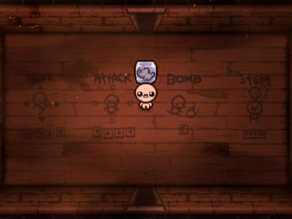

# Warp Cube Baby | [Download on Steam Workshop](https://steamcommunity.com/sharedfiles/filedetails/?id=3499136418)

_Your cubic companion just learned a new trick!_

Warp Cube Baby is a mod for The Binding of Isaac that upgrades Cube Baby with a dimensional twist. Instead of getting stuck in doorways, it now warps seamlessly through them.

**🧊 Compatible with REP / REP+**

## Features:

- When pushed into any doorway, Cube Baby vanishes and emerges from the opposite side.
- If the opposite door is blocked, pops out from a random open exit instead.
- Maintains momentum when warping through opposite doors.
- **Only works with open doors.**
